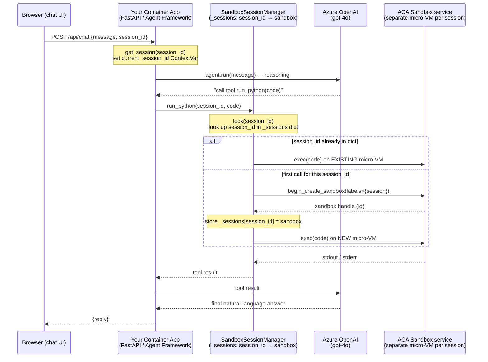
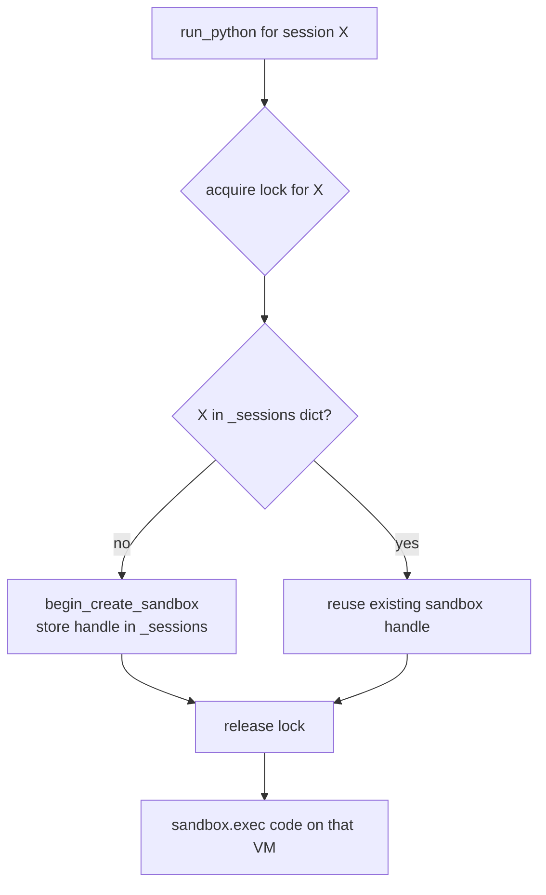

# Agent Framework + ACA Sandbox session isolation

A Microsoft Agent Framework agent that runs as an **Azure Container App** and
isolates code execution **per chat session** using **Azure Container Apps
Sandboxes** — the same pattern Microsoft Foundry uses for its code interpreter.

Every conversation gets its own dedicated sandbox: a private Linux environment
with its own filesystem, processes, and network namespace. Code run for one
session can never see or affect another session's state.

## Architecture

Three tiers, each running in a **different** place. Your Container App is only the
orchestrator — it never executes the model's code itself. Each sandbox is a
separate `cloudhypervisor` micro-VM managed by the ACA Sandbox service.



The stickiness lives entirely in that `_sessions` dictionary: the same `session_id`
always finds the same sandbox handle, so it routes to the same micro-VM. A
per-session lock ensures two concurrent requests for one session can't each
create a sandbox.



| Tier | Hosting service | Role | Lifetime |
| --- | --- | --- | --- |
| Container App | Azure Container Apps | Orchestrator / API / UI | Always-on (1 replica) |
| Azure OpenAI | Cognitive Services | Reasoning + tool calls | Managed service |
| Sandbox | ACA Sandbox (Dynamic Sessions) | Isolated code execution | Per session; auto-suspends, deleted on reset |

## How session isolation works

- Each browser session has a `session_id` (generated client-side).
- `SandboxSessionManager` (`app/sandbox.py`) maps `session_id → one sandbox`.
  The first time a session runs code, a sandbox is created; later calls reuse it,
  so the agent can build up state (files, variables written to disk) across turns.
- The active `session_id` is stored in a `ContextVar` before each `agent.run`, so
  the `run_python` tool always targets the correct session's sandbox.
- `POST /api/sessions/{id}/reset` (or "New session" in the UI) deletes the
  sandbox and starts fresh. All sandboxes are torn down on app shutdown.
- Idle sandboxes auto-suspend (`SANDBOX_AUTO_SUSPEND_SECONDS`) so you only pay
  for active wall time.

## Project layout

| Path | Purpose |
| --- | --- |
| `app/agent.py` | Builds the Agent Framework agent + `run_python` tool |
| `app/sandbox.py` | Per-session sandbox lifecycle (the isolation core) |
| `app/main.py` | FastAPI endpoints + chat UI hosting |
| `app/static/index.html` | Minimal chat UI |
| `app/config.py` | Environment-driven settings |
| `scripts/setup_sandbox.py` | Creates the sandbox group + grants data-plane role |
| `infra/main.bicep` | Container App, managed identity, role assignments |
| `Dockerfile` | Container image |

## Prerequisites

- Python 3.13+
- Azure CLI (`az login`)
- An Azure OpenAI resource with a chat model deployment (e.g. `gpt-4o-mini`)
- Permission to create resource groups and role assignments

## Run locally

```powershell
python -m venv .venv
.\.venv\Scripts\Activate.ps1
pip install -r requirements.txt

Copy-Item .env.example .env   # then edit values
az login

# One-time: create the sandbox group and grant YOUR user data-plane access
python scripts/setup_sandbox.py --principal-id (az ad signed-in-user --query id -o tsv) --principal-type User

uvicorn app.main:app --reload
```

Open http://localhost:8000 and try:

- "Compute the 50th Fibonacci number."
- "Create a CSV of 5 random rows and show me its contents."
- "Save a variable x=42 to a file, then in your next step read it back." (proves state persists within a session)

For local dev you can skip managed identity and set `AZURE_OPENAI_API_KEY` in `.env`.

## Deploy as a Container App

```powershell
# 1. Variables
$RG = "my-rg"; $LOC = "eastus2"; $ACR = "myacr$((Get-Random))"
$AOAI = "my-aoai"; $DEPLOY = "gpt-4o-mini"; $SBGROUP = "my-sandbox-group"

# 2. Create RG + ACR and build/push the image
az group create -n $RG -l $LOC
az acr create -n $ACR -g $RG --sku Basic --admin-enabled false
az acr build -r $ACR -t agent-sandbox:latest .

# 3. Deploy the Container App + identity + role assignments
az deployment group create -g $RG -f infra/main.bicep -p `
  containerImage="$ACR.azurecr.io/agent-sandbox:latest" `
  acrName=$ACR aoaiName=$AOAI aoaiDeployment=$DEPLOY sandboxGroupName=$SBGROUP

# 4. Grant the app's managed identity sandbox data-plane access
$PRINCIPAL = az deployment group show -g $RG -n main --query properties.outputs.principalId.value -o tsv
$env:AZURE_SUBSCRIPTION_ID = (az account show --query id -o tsv)
$env:AZURE_RESOURCE_GROUP = $RG; $env:AZURE_SANDBOX_GROUP = $SBGROUP; $env:AZURE_REGION = $LOC
python scripts/setup_sandbox.py --principal-id $PRINCIPAL --principal-type ServicePrincipal

# 5. Open the app
az deployment group show -g $RG -n main --query properties.outputs.appUrl.value -o tsv
```

## Notes

- Session/thread state is kept in-process for sample simplicity. For multiple
  replicas, back it with a shared store (Redis/Cosmos DB) or use sticky routing,
  and keep `minReplicas: 1`.
- The agent uses managed identity (`DefaultAzureCredential`) for both Azure
  OpenAI and the sandbox SDK when no API key is set.

## References

- [ACA Sandboxes — Python SDK quickstart](https://sandboxes.azure.com/docs/sandboxes/quickstart/setup-python-sdk)
- [Microsoft Agent Framework](https://learn.microsoft.com/en-us/agent-framework/overview/agent-framework-overview)
